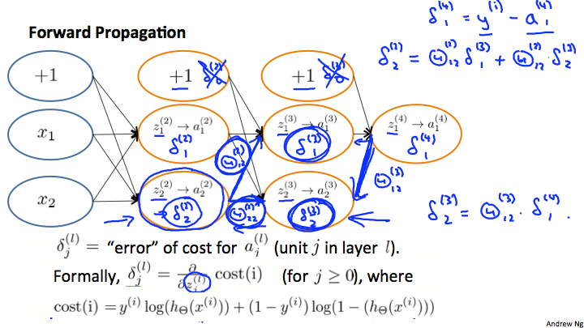

当前机器（深度）学习的核心的

- 利用可微编程进行优化（收敛）
- 利用反向传播增加深度及收敛

Features必须是有效的，只是我们（programmer）不知道如何组合应用这些feature去预测，所以用机器学习的方法。

<h1> 1. Courera Machine-learning </ha>
<!-- TOC -->

- [1. Week_Introduction](#1-weekintroduction)
- [2. Week_Logistic Regression](#2-weeklogistic-regression)
    - [2.1. Advanced Optimizaion](#21-advanced-optimizaion)
        - [2.1.1. Solving the problem of Overfitting](#211-solving-the-problem-of-overfitting)
    - [2.2. ex](#22-ex)
- [3. Week_Neural Networks: Representation](#3-weekneural-networks-representation)
    - [3.1. max (x)](#31-max-x)
    - [3.2. find](#32-find)
- [4. Week_Neural Networks: Learning](#4-weekneural-networks-learning)
- [5. Week_Advice for Applying Machine Learning](#5-weekadvice-for-applying-machine-learning)
    - [5.1. Model Selection](#51-model-selection)
    - [5.2. Bias vs Variance](#52-bias-vs-variance)
    - [5.3. Choose Regulariztion](#53-choose-regulariztion)
    - [5.4. Learning Curve](#54-learning-curve)
    - [5.5. Summary: What to do to improve performance](#55-summary-what-to-do-to-improve-performance)
    - [5.6. NN](#56-nn)
    - [- large NN](#large-nn)
    - [5.7. Eror Analysis](#57-eror-analysis)
    - [5.8. Using Large Data Set](#58-using-large-data-set)
- [6. Week_Support Vector Machine, SVM](#6-weeksupport-vector-machine-svm)
    - [6.1. Support Vector Machine, SVM](#61-support-vector-machine-svm)
    - [6.2. Math behind SVM](#62-math-behind-svm)
    - [6.3. Kernels](#63-kernels)
    - [6.4. Support Vector Machines](#64-support-vector-machines)
    - [6.5. Excise](#65-excise)
- [7. Week_](#7-week)
    - [7.1. Unsupervied Learning](#71-unsupervied-learning)
    - [7.2. Clustering: K-Means Alogrism](#72-clustering-k-means-alogrism)
        - [7.2.1. Optimization Objectives](#721-optimization-objectives)
    - [7.3. Dimensionality Reduction](#73-dimensionality-reduction)
    - [7.4. PCA](#74-pca)
        - [7.4.1. mean normalization](#741-mean-normalization)
        - [7.4.2. scale](#742-scale)
        - [7.4.3. how to get u](#743-how-to-get-u)
        - [7.4.4. how to choose k](#744-how-to-choose-k)
        - [7.4.5. Advice for applying PCA](#745-advice-for-applying-pca)
- [8. Week_Anomaly Detection](#8-weekanomaly-detection)
    - [8.1. Density Estimation](#81-density-estimation)
        - [8.1.1. Problem Motivation](#811-problem-motivation)
        - [8.1.2. Gaussian Distrubution](#812-gaussian-distrubution)
        - [8.1.3. Algrithm : Density estimation](#813-algrithm-density-estimation)
    - [8.2. Building an Anomaly Detection System](#82-building-an-anomaly-detection-system)
        - [8.2.1. Alogrithm](#821-alogrithm)
        - [8.2.2. Anomaly Detection vs Supervised Learning](#822-anomaly-detection-vs-supervised-learning)
        - [8.2.3. Choosing What Features to Use](#823-choosing-what-features-to-use)
    - [8.3.  Multivariate Gaussian Distribution](#83-%08-multivariate-gaussian-distribution)
    - [8.4. Predicting Movie Ratings](#84-predicting-movie-ratings)
        - [Content based Recommenation](#content-based-recommenation)
    - [8.5. Collaborative Filtering](#85-collaborative-filtering)
    - [Low Rank Matrix Factorizatoin](#low-%08rank-matrix-factorizatoin)

<!-- /TOC -->
# 1. Week_Introduction

- Supervised Learning: give machine a labled dataset to find the relationship between the data and the labelss
	- Regression
		- map input variables to some continuous function 
	- Classification
		- predict results in a discrete output
	- 只强调连续、离散性
- Unsupervised Learning : 
	- give machine a unlabled dataset to let it find out the structure of the data
	- With unsupervised learning there is no feedback based on the prediction results.
	- Clustering（聚合） and Cocktail Party Algorithm(分解)


# 2. Week_Logistic Regression

## 2.1. Advanced Optimizaion

根据前面学过的内容，一般的梯度下降需要我们自己选合适的alpha，选定迭代次数，收敛的结果还不一定保证到最优。
Octave提供了一些使用优化的方法来达到theta的快速收敛。

- 如每次迭代使用不的alpha...具体的实现见课程了
- 我们需要将待定的J(theta)，及J(theta)对theta_i的偏微分告诉优化算法，其他的就由优化算法自己处理了。

### 2.1.1. Solving the problem of Overfitting

- Overfitting
	- underfit
	- fit
	- overfit: high variance

- Addressing overfitting
	- Reduce number of features
		- Manually select
		- Model selection algorithm
	- Regularization
		- J(theta)=J(theta)+1000xtheta1^2+1000xtheta2^2 
		- to keep the theta as small as possible
		- too small may elimate the effect of (thetai x Xi) 

## 2.2. ex

- 小心 X(1+2)不会解释为乘法，而是引用X中的元素
- 注意 ./ 与 / 的差别
- Regularition 
	- 注意 J（theta）及求导计算时均没有对theta0的penalty. 

# 3. Week_Neural Networks: Representation

NN使用

- **线性组合+激活函数**来定义每一层，我感觉是利用的激活函数指数处理的效果，达到类似高阶多项式的功能，但更灵活高效。
- 每一层都是对上层输出的再计算，每一层都取样不同的特征。课程中手写识别的视频非常直观，类似于上层函数调用底层函数的效果，形成的知识的复用。

本节中讲的激活函数还是Logistic regression中的。

## 3.1. max (x)

- max (x, [], dim)
- [w, iw] = max (x) 
- max (x, y)

Find maximum values in the array x ， 亦可返回索引iw; 对二维矩阵默认返回一行，如果想返回列就需要设定dim=2，同时中间加一个空矩阵参数[]，我猜是实现时为了区别参数而采用

## 3.2. find

index_zero = find( pred1 == 10);
找出pred1中所有数据为10的元素的下标。

pred1( index_zero, 1) = 0 ;
然后将这些元素的值设置为0.

# 4. Week_Neural Networks: Learning



- error of cost is: y - a ,对最后一层而言
- 可以方便计算前一层的error
	- 利用的激活函数的数据特征，
- 这个error就是激活函数偏导数

- octave 矩阵操作
- “;”分行，“，”或“ ”分列
- X = [1 2; 3 4 ; 5 6]
- X = [1,2; 3,4; 5,6]
- X(2:end,:) 去除第一行

# 5. Week_Advice for Applying Machine Learning

## 5.1. Model Selection

数据集分为：Training Set, Cross Validition Set, Test Sec

Training Set 用来得到theta；Cross Validtaion Set用来选择lambda、多项式的阶数等决定模型的参数。

这个确定模型的过程就是Model Selection。

如果所有选择都通过Training Set得到，就容易产生overfitting的问题。

## 5.2. Bias vs Variance

以只有一个输入变量为例,当然本质上x^p可以当成其他输入。

h = theta0 + (theta1\*x + theta2\*x^2 + theta3\*x^4....) 

theta0对h影响太大，就是underfitting，就是Bias问题，结果就是预测结果曲线太平，不能反映变化的式样；
（theta1\*x + theta2\*x^2 + theta3\*x^4....）对h影响太大，就是overfitting，就是Variance问题，就是预测结果曲线太曲，genelization不够好。

## 5.3. Choose Regulariztion

lambda是加在CostFunction里，惩罚theta1-n的。

lambda太小，惩罚不够，产生Overfitting；
lambda太大，惩罚守重，首先underfitting。

## 5.4. Learning Curve

是数据集大小的函数。随着数据集变大，Jtraining, Jcv和Jtest值。

随着测试集变大：

- 当Jcv和Jtraining靠近到一起时
	- 如果error较小则好
	- 如果error较大，说明有high bias问题，此时太增加测试集也没有用，因为theta0影响太大，后面的多项式再调整也没用。
- 当Jcv和Jtraining中间有gap时：
	- High Variance问题，增大测试集，理优的THETA，能改善该结果。

**编程时的小细节**：使用CostFunction学习THETA时，lambda是有值的；计算Jcv,Jtraining,Jtest时，lambda需要为0，因为此时只有计算error,不需要惩罚theta1-n。	 	 
## 5.5. Summary: What to do to improve performance

- More training data: fix high variance
- Few features: fix high variance
- More features: fix high bias
- Polynomial: as above
- higher lambda: fix high variance
- lower lambda: fix high bias


## 5.6. NN

- large NN
	-	 
- small NN
	- computitonal efficent
	- underfitting	 

## 5.7. Eror Analysis

Evidence driving deision making instead of 'gut feeling'

single raw number evidene like Jcv make it easy to see the improvement

Mannually analyse the training examples where your algorism poorly works on. 

Try any new ideas or tools to get the number evidence to determine to use it or not.

## 5.8. Using Large Data Set

A high performance algorism should meet:

1. Check if a human experts can predicy y with given features 
2. and a model with sufficient x which eliminate high bias.
2. Larget training set, which will eliminate high variance.


# 6. Week_Support Vector Machine, SVM

## 6.1. Support Vector Machine, SVM

Sometimes is called Large margin classifier, since it provide a margin between positive and negtive examples.

Change the cost function of logistic regression

## 6.2. Math behind SVM
u=[u1,u2] v=[v1,v2]
u'v=p\*||u||=p\*(u1^2 + u2^2 ) ^(1/2)

- ||u||是向量u的长度
其中p是v在u上的投影；当两个向量夹角小于90度（同向）时p为正，反之为负；
*结论*：u与v夹角越小（相似），p越大，u'v也就越大。


根据SVM Cost function的定义

- 当y=1时，我们希望theta与x越相似越好（theta'x>>1）
- 当y=0时，我们希望theta与x越不像越好（theta'x<<-1）

这就是选theta的直观依据。

## 6.3. Kernels

1.Put several Landmark in the coordinate system。
2.Similarity function or Kernal function, caculate the distance between the sample data and the Landmark

首先选选择合适的landmark/kernel点，这些点就是样本应该聚拢的点；
其次要选择Kernel Function，这些函数描述了离开landmark点的距离会造成多大的衰减。
离landmark近，结果应该是1;离landmark远结果就应该是0;Kernel Function就是描述距离与结果的关系。
Gussian Kernel:

- 使用高斯函数作为Similarity Function, f,结果就是：
	- f~=1 当x与landmark相似时
	- f~=0 当x与landmark不同时
	- 高斯函数有一参数，决定了山的半径与坡度，其值与半径成正比。即与landmark离多近可以叫相似，多远后就是完全不同。

## 6.4. Support Vector Machines

Kernel

- 一般用Gussian核
- 每个样本本身就是一个landmark
- 对每个样本(x,y),新的feature是每个样本与其他样本的“相似度”，所以新features是m个。

Choose SVM parameters C:

- Large C : high variance,Low bias 
- Small C: lower variance,higher bias

## 6.5. Excise

- 选定C和sigma
- 训练得theta
- 交叉验证
- 重复以上步骤，以得到最优的交叉验证结果

```
v=[0.01,0.03,0.1,0.3,1,3,10,30];
len=length(v);

for i=1:len
   for j=1:len
      C_temp = v(i);
      sigma_temp = v(j);
      model= svmTrain(X, y, C_temp, @(x1, x2) gaussianKernel(x1, x2, sigma_temp));
      predictions = svmPredict(model, Xval);
      err_temp = mean(double(predictions ~= yval));
      
      if ( i == 1 & j ==1)
         C = C_temp;
         sigma = sigma_temp;
         err = err_temp;
      elseif (err_temp < err)
         C = C_temp;
         sigma = sigma_temp;
         err = err_temp;
      endif
   endfor
endfor

``` 

# 7. Week_

## 7.1. Unsupervied Learning

- Unlabeled data set
- aim to find the structure of the data set
- clustering alogrism and 

## 7.2. Clustering: K-Means Alogrism

- randomly pick centroid
- assigned xi to neareast centroid
- move centroid to means of x assigend to it
- repeat this process until centroid stop moving

### 7.2.1. Optimization Objectives

C^\(i) is the index of centroid, x^i is assigned to.  

Cost function J:

\\[
sum(||x^i - u_\ci || ^2)/m
\\]

## 7.3. Dimensionality Reduction

## 7.4. PCA

### 7.4.1. mean normalization

replace xi with xi - mean(x)

### 7.4.2. scale

scale difference features to comparable values

### 7.4.3. how to get u

sigma = X' * X /m 

[U,S,V] = svd (sigma)   the firest K columns is the u you need

Uk = U (:,1:k); n.k
z = Uk' * x ; k.n * n.1 = k.1  
Z = X * Uk' ;  % m.n * n.k = m.k

注意：这里说到vector都是一列
但样本集：X 中一个样本是一行啊！！

### 7.4.4. how to choose k

- retain 95%-99% of variance

- variance = mean(sum((xi - xi-variance)^2 )) / mean(sum(xi ^2 )) 

= 1 - sum^1-k ( sii)/ sum^1-n (sii)

- find the minium k : sum^1-k ( sii)/ sum^1-n (sii) >= 0.99, which is the minimum k retain 99% of the variance.

### 7.4.5. Advice for applying PCA

# 8. Week_Anomaly Detection

## 8.1. Density Estimation

### 8.1.1. Problem Motivation

- Given a data set X will n features: x1, x2 ... xn.

- Find a model p(x) to best describle the X.

- Use p(x) to estimate new data to see it's normal or anomaly.

### 8.1.2. Gaussian Distrubution

x ~ Gussain( u, sigma^2 ).

### 8.1.3. Algrithm : Density estimation

- Assume, each feature xi distributed according to a Gaussian dsitribution g(ui, sigma_i^2).
- use trainning set X to find U and Sigma for all features.
- Use found value to estimate any new data x.

Finally:

- $ p(x) = p(x_1; u_1, sigma_1^2 ) * p(x_2; u_2, sigma_2^2 ) ... p(x_n; u_n, sigma_n^2 ); $ 
- $ u_j = mean(sum(x^i_j) ); $
- $ sigma_i = mean(sum( (x^i_j-u_j)^2 ) ) $
- if p(x) < threshold then it's anormaly. Need define a threshold.

> Assumption is that all those features are independent to each other.
> PCA could be used in advance to get independant features.

## 8.2. Building an Anomaly Detection System

### 8.2.1. Alogrithm

For example, you have 10000 normal samples, and 20 flawed samples. Split them as the following:

- 6000 unlabeld normal data set for trainning set.
- 2000 labelled normal and 10 flawed sample in cross-validation set.
- 2000 labelled normal and 10 flawed samples in test set.

Don't use the same samples in CV and Test data set.

Use Prceision/Recall (F1-score) to evaluate the model of choose threshold. 

### 8.2.2. Anomaly Detection vs Supervised Learning

Choose Anomaly Dectetion when:

- you have **far few** positive sample data (y=1 or flawed sample).
- It's hard to learn from positive examples, too many different type of anomaly samples, like network intrution, malware, it change rapadly.

所有核心是看数据，如果数据中有大量positive样本，算法能学到就可以用supervised learning. 如果数据中基本都是negtive样本，就只能用基于正态分布的Anomaly Detection了。

加Features其实就是现有Features的组合或变形（运算），可能通过加一层NN来实现。

### 8.2.3. Choosing What Features to Use

Since Gussian distribution is used that your features sample should distributes in a Gussain way.

- Plot your feature x1 of of all samples to see the distributes. 
- Transform it to make it distribute in a Gussian way, if it doesn't.
    - for example, use new feature like log(x1) to replace x1.

> octave, hist to plot data.

如果positive样本就处在高斯分布的中央位置，那意味着，我们需要引用新features. 必须把它分布在边缘。

如果你的features与anormaly无关，那当然检测不出来。

## 8.3.  Multivariate Gaussian Distribution

如上实现的Anomaly Detection各个Features是相互独立的，没有相关性。
但在实际应用中，有时需要根据Features之间的相关性进行判定是否Anormaly,例如:

- CPU高，内存高 是正常
- CPU高，内存低 是异常

这是就需要引入Features相关性，即Multivariate Gaussian Distribution。

具体实现octave中都有现成的算法，应用即可。

计算复杂度高。

## 8.4. Predicting Movie Ratings

### Content based Recommenation

前提：每部电影都得有Features，如action=0.99, romantic =0.5。

然后这个问题就退化为一个线性回归了，为每个用户找一个 theta, 满足：

- theta' * features_vector = rated_scores. 

然后就可以拿这个公式来预测了。

## 8.5. Collaborative Filtering

反过不，如果已知 theta， 就可以用同样的算法来得到 features_vector.

在实际应用中，可以随机生成一个 theta -> features_vector -> theta -> ..., 可以不断优化。

通过算法学到的实际的Features, 并非有意义的“action, romantic”之类，只是一个数值的矩阵，和我们在电影网站看到分类不是一回事。

## Low Rank Matrix Factorizatoin 

Mean Normalization:

- 学习前：algorithm_rating = real_rating - mean(real_rating)
- 预测时：predicted_rating = algorithm_rating + mean(real_rating)


# 9 Week-Ten Learning With Large Datasets

## 9.1 Gardient Descent with Large Datasets

### 9.1.1 Learning With Large Datasets

Larger dataset contribute little to high bias problem while will improve the performance of high variance problem.

So, to plot a learning curve based on m, to verify the learning algorithm is a good idea. 

### Stochastic Gradient Descent

传统的Gradient Descent又称为 Batch Gradient Descent. Batch就是指使用**所有**样本数据求解。

Stochastic GD, 是让theta对每一个样本进行迭代更新

- 运算速度大大加快
    - BGD，一步就需要求和所有样本；SGD遍历一次样本基本就完成计算了。
- 每步迭代最不保证是方向正确的
- 最终结果不保证的最优的
- 可以重复1-10次这样的过程，基本上可以达到较好的效果。每重复一次仅相当于BGD迭代一次的计算量。
- 在样本空间较大时百万级以上，这种算法性价比较高。

### Mini-Batch Gradient Descent

- BGD每次迭代需要计算所有样本
- SGD每次迭代只需要一个样本
- MGD每次迭代需要b个样本，1<b<<m，典型的2<b<100
    - MGD比SGD快的原因是b样本求和可以用矩阵运算实现
    - **My idea**这样说的话，b应该依据硬件支持的最大并行数  

### Stochastic Gradient Descent Convergence

#### How to make sure it converge

SGD不保证每步方向的正确；只保证对当前样本是在优化，所以：

- 对某样本
    - 针对该样本的theta更新前计算处cost1,theta更新后计算下cost2；
    - 所有样本cost2<cost1就说明算法本身是没问题的
- 所以可以基于iteration plot cost
    - 每样本一plot:整体走向是下降的，噪点多，不平滑
    - 每n样本一plot cost均值:整体走向是下降的，n越大越平滑
    - 如果整体上升说明alpha太大
    - 如果起伏不定，那就是算法错了吧    

#### How to pick alpha

alpha = constant1/(iterationCount+constant2)

- 原由
    - SGD是的每一迭代都是在当前theta的基础上根据样本**随机**的调整alpha，不保证是**优化**
        - 再次强调，SGD整体方向是在优化，但每步不一定是在优化theta。 
    - 所以希望在越到后来（离全局最优解越近），每次调整的幅度就越小，这样最终不会在最优解周围跳的太远。

## Advanced Topics

### Online Learning

就是根据实时的访问数据，实时的学习。而不是通过整理好的样本集学习。

### Map Reduce and Data Paralelism

# Week-Eleven 

## Photo OCR


