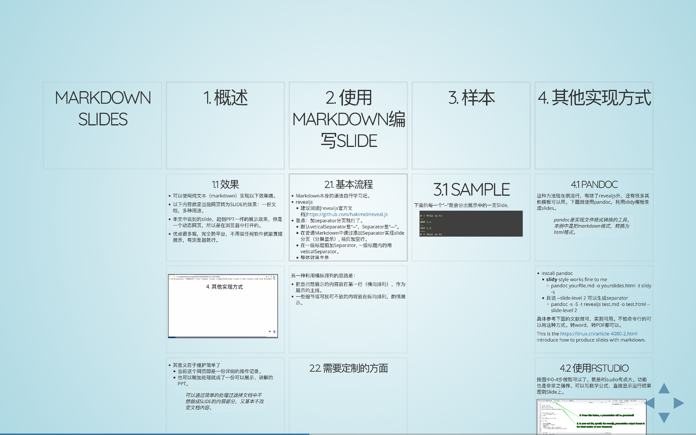

<style type="text/css">
    p { text-align: left; }
</style>

<h1> Markdown Slides </h1>

# 1. 概述

## 1.1 效果

- 可以使用纯文本（markdown）实现以下效果哦。
- 其意义在于内容与显示的分离。
- 以下内容就是本文档转为SLIDE的效果。


## 1.2 实现方法1：使用vscode 

- 安装vscode编辑器
- 在vscode安装插件，revealjs
- 编辑文档你的slide文档
- 然后在vscode中，按F1，进入命令行
    - 选：Revealjs:show presentation in slide
- 优点：
  - vscode插件非常之多，非常好用。
  - 可以直接预览效果。
- 缺点：
  - 这种方式，需要自己手工加每一页slide的分隔符“---”。
  - 我还没找到现成的解决方案，但肯定有。后期有空了再找吧。

又不想手工分页，就找了下面这个工具，可以自动添加分隔符。

## 1.3 实现方法2：使用RStudio


- 优点：
  - 自动为一二级标题切分slide页。
  - 有些需要额外分页的，需要手工加“--”（一级标题下的内容部分，纵向切换）。
  - 这样在写作时就维护一份文档就可以了。即可以用来讲课，又可以做实践指导啥的。
 
- 缺点：
  - RStudio非常强**大**，用来做这个有点笨重
  - 没有直接预览。
  
# 2. 使用Markdown编写Slide

## 2.1. 基本流程

- Markdown本身的语法自行学习吧。
- revealjs
  - 建议阅读[revealjs官方文档]<https://github.com/hakimel/reveal.js>
- 重点：
    - 默认veticalSeparator是“--”，Separator是“---”。
    - 在普通Markdown中通过添加Separator实现slide分页（分屏显示）, 前后加空行。
    - 在一级标题前加Separator, 一级标题内的用veticalSeparator。
    - 整体效果主是
      - 左右键会在一级标题级间切换；上下键可在一级标题内切换。
      - 第一行Slide都是一级标题，标题内的本级标题下的页面。

下面的图并未优化，略乱，只是为了展示排列效果。


## 2.2. 个人定制

### 2.2.1. 文本段落左对齐

默认是居中对齐，看着非常怪。在文档前面加上如下内容。

```

<style type="text/css">
    p { text-align: left; }
</style>

```

基本的文本格式如下：

```

--- //revealjs参数设置，必须在第一行
theme : "white"
transition: "convex"
separator: "\n---\n"
veticalSeparator: "\n--\n"
---

<style type="text/css">   //加入个性化的css参数
    p { text-align: left; }
</style>

The rest are the markdown main content. //剩下是md文本内容

```

### 2.2.2. 自动生成separator

- 使用RStudio实现。

# 3. 样本

下面的第一“--”就会分出一展示中的一页Slide.

```markdown

# 1 This is h1
--
### 1.1
--
### 1.2 
---
^# 2 This is h1

```
# 4. 其他实现方式

- Install local pandoc
    - **slidy** style works fine to me
        - pandoc yourfile.md -o slides.html -t slidy -s
- pandoc plugin for vscode
- revealjs plugin for vscode also works

This is the <https://linux.cn/article-4080-2.html> introduce how to produce slides with markdown.


